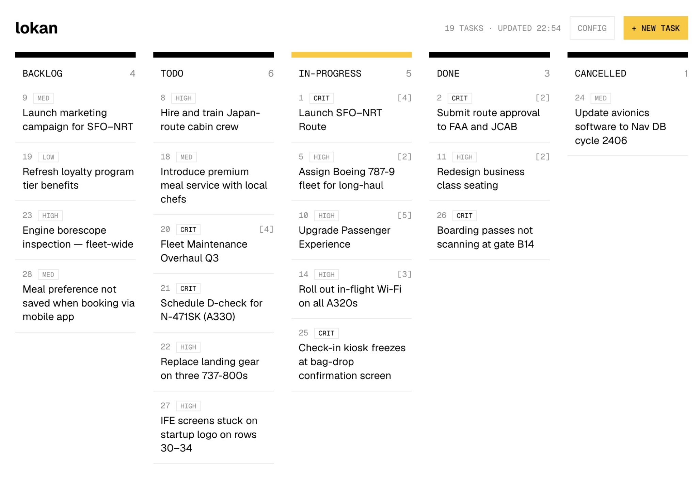

# lokan

Markdown-based task manager — your board is a plain `.md` file.



## Features

- **One file, plain markdown** — the whole board is a git-friendly `.md` file. Diffable, greppable, reviewable in PRs.
- **No database** — state is the file; every command targets it explicitly (`lokan <cmd> <board>`). No discovery, no default path, no sync.
- **Two interfaces, one board** — humans get a terminal-aesthetic web UI + CLI; AI agents get the same file and a compact `list --md` view. Both read and write the same board.
- **One binary** — no database, no server to install. Download, run, done.
- **Configurable lanes** — statuses live in the board's config block: add, rename, archive lanes, bulk-clear.
- **Frozen contracts** — HTTP API and design tokens are versioned docs (`docs/api.md`, `docs/design/tokens.md`); drift needs a doc update first.

## Install

Prebuilt binaries via GitHub releases:

```bash
curl -fsSL https://raw.githubusercontent.com/avrebarra/lokan/main/install.sh | sh
```

The binary goes to `~/.local/bin` (override with `LOKAN_INSTALL_DIR`).
Alternatives:

- **Releases page** — download the `tar.gz` for your platform from
  [releases](https://github.com/avrebarra/lokan/releases), extract, and
  put the binary on your `PATH`.
- **Build from source** — needs Go ≥ 1.26 + Node ≥ 18 + Ruby; see
  [Development](#development).

## Quick start

```sh
lokan init docs/board.md                          # create a board — required first
lokan create docs/board.md "Fix counter race"
lokan list docs/board.md
```

```text
ID  STATUS       TITLE
──────────────────────────────
1   in-progress  Fix counter race
2   backlog      Drag ghost on narrow screens
3   backlog      Write README
```

```sh
lokan edit docs/board.md 1 --status done    # move lanes / update fields
lokan ui docs/board.md                      # web UI — prints the URL (default localhost:17762; auto-picks a free port if taken)
```

Every command except `init`/`help` takes the board as its first positional
argument, and errors when the file is missing or lacks the lokan config marker:

```text
$ lokan list nope.md
error: not a lokan board: /abs/path/nope.md (run lokan init nope.md)
```

## How the board works

The board file is the whole state: a banner comment explaining the format,
a `<!-- lokan:config` block (title, counter, version, lanes), and task
blocks grouped into Active / Archive sections. Each task opens with a
`### <id> — <title>` heading and a ```lokan code block holding the YAML
frontmatter, so the details are visible in rendered markdown too.
Archived lanes (`done`, `cancelled` by default) live
under `## Archive`; everything else under `## Active`.

<!-- prettier-ignore -->
```markdown
<!--
This board is a lokan kanban / roadmap — created and managed by lokan.
Format: lokan:config block + ### <id> — <title> heading + lokan fence + body.
Reference: https://github.com/avrebarra/lokan/blob/main/docs/guides.md
-->

<!-- lokan:config
title: Lokan Board
counter: 3
version: "3"
statuses:
    - id: backlog
    - id: todo
    - id: in-progress
    - id: done
      archived: true
    - id: cancelled
      archived: true
-->

## Active

### 1 — Fix counter race
```lokan
id: "1"
title: Fix counter race
status: in-progress
created: "2026-08-13"
updated: "2026-08-13"
```

# Fix counter race

Body markdown — notes, links, anything. `created`/`updated` are engine-owned.

## Archive

### 2 — Submit route approval to FAA and JCAB

```lokan
id: "2"
title: Submit route approval to FAA and JCAB
status: done
created: "2026-08-13"
updated: "2026-08-13"
```

# Submit route approval to FAA and JCAB

````

IDs are plain counters (`1`, `2`, …) and never reused.
The engine rewrites the file atomically under `<board>.lock` — never hand-edit
a live board; use the CLI or API.

## Commands

| command                  | description                                                                                 |
| ------------------------ | ------------------------------------------------------------------------------------------- |
| `init <board>`           | create a board                                                                              |
| `create <board> <title>` | new task — `--tag` (repeatable)                                                             |
| `get <board> <id>`       | full task (frontmatter + body)                                                              |
| `list <board>`           | tasks as a table — filter `--status/--tag`; `--md` for compact agent markdown               |
| `edit <board> <id>`      | `--status/--title`                                                                          |
| `clear <board>`          | bulk delete — `--archived` or `--all`                                                       |
| `ui <board>`             | serve the web UI — `--port/-p` (default 17762; fails if explicit port is taken), `--no-browser` (skip auto-open) |

## Web UI

`lokan ui <board>` serves the web UI and prints the URL
(`localhost:17762`, or a free port if 17762 is taken). An explicit
`--port` is a hard requirement — it fails if already in use. Brutalist-terminal
aesthetic: monochrome, mono labels,
rows with hairline separators, one yellow accent on the in-progress column.
Light is the default; dark is opt-in.

One column per configured lane (narrow screens stack vertically). Click a row
for detail (fields, notes); drag rows between lanes. `+ new task`
creates from the UI; `config` edits lanes (add/rename/remove, archived flag)
and bulk-clears archived or all tasks.

## API

JSON API for the UI — contract frozen in `docs/api.md`:

| endpoint                    | purpose                                                         |
| --------------------------- | --------------------------------------------------------------- |
| `GET /`                     | embedded app                                                    |
| `GET /api/tasks`            | `{ tasks, statuses, root }` — everything the board renders      |
| `GET /api/task/:id`         | full task                                                       |
| `POST /api/create`          | new task `{ title }` → `{ task }`                                         |
| `POST /api/update`          | `{ id, field, value }` → `{ task }`                             |
| `POST /api/move`            | `{ id, status, beforeId? }` → `{ task }` (position within lane) |
| `POST /api/config/statuses` | replace lane set → `{ statuses, moved }`                        |
| `POST /api/clear`           | `{ scope: "archived"\|"all" }` → `{ deleted }`                  |
| `POST /api/seed`            | demo data → `{ created }`                                       |

Errors are uniform: 400 validation, 404 not found / unknown route, 500
internal — body always `{ "error": "<message>" }`.

CLI discipline: stdout carries results, stderr carries errors only; exit code
0 on success, 1 on any failure (`error: task not found: 99`).

## Development

Building from source needs the toolchain:

| Tool      | Why                                                   | Install             |
| --------- | ----------------------------------------------------- | ------------------- |
| Go ≥ 1.26 | engine (`engine/`)                                    | `brew install go`   |
| Node ≥ 18 | web build — Vite + TypeScript (`web/`)                | `brew install node` |
| Ruby      | `./runtask` task runner (stdlib only, macOS ships it) | `brew install ruby` |

```sh
./runtask build       # vite build → embed → go build → dist/lokan
./runtask dev web     # Vite dev server with HMR + mock API server
./runtask dev engine  # run built binary on scratch board + demo data, no rebuild
./runtask test        # engine Go tests
./runtask e2e         # full smoke: build + init + create + list + ui + API
./runtask bump patch  # cut a release: tag next version + push (see docs/release.md)
````

`./runtask build` produces `dist/lokan` — the dev-built binary, same commands
as the installed one. Release binaries come from tagged commits; the pipeline
(GoReleaser + GitHub Actions + `install.sh`) is documented in
[`docs/release.md`](docs/release.md).

Layout: `engine/` (Go: urfave/cli, core store/id/query, HTTP server, embedded
web) · `web/` (Vite + React + TS, design system in `docs/design/`). The build
copies `web/dist` into `engine/web/dist` and embeds it via `go:embed`.

## Design

`docs/design/tokens.md` is the frozen design spec (colors, type, components,
contrast rules); `docs/design/mockup.html` is the approved visual contract.
Deviations need approval.

## Contributing

Docs follow the contracts in `docs/` (`api.md`, `design/tokens.md`,
`guides.md`) — when code moves, docs move with it. Run `./runtask test` and
`./runtask e2e` before opening a PR. Full doc index: [`docs/README.md`](docs/README.md).

MIT — see [`LICENSE`](LICENSE).
